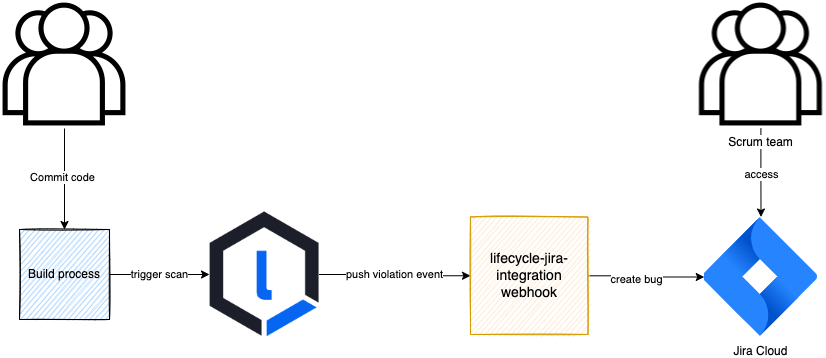

# Sonatype Nexus Lifecycle-Jira cloud integration
[Sonatype Nexus Lifecycle](https://www.sonatype.com/products/open-source-security-dependency-management?topnav=true) is an SCA product. Currently, Sonatype Nexus Lifecycle cannot push violation events to __Jira cloud__ through a builtin plugin or software. This is a middleware component that can listen to Lifecycle violation events and create Jira cloud tickets




## Reference
- [Lifecycle Webhooks](https://help.sonatype.com/iqserver/automating/iq-server-webhooks#IQServerWebhooks)

## Features
1. Implements a POST endpoint __/lifecycle/violation__ that will listen to Nexus Lifecycle violation events
2. Works with Jira cloud (Should work in Jira datacenter as well, but not tested)
3. Lightweight Express JS middleware
4. Configurable [Jira payload template](src/configs/jiraTemplate.json)
5. Post data to Jira webhook that creates a story/bug. If there are multiple violations and multiple components per violation, a jira ticket is created per component. So one event can trigger multiple Jira tickets
6. Jira webhook is tied to a specific project. This middleware supports pushing jira events to only 1 webhook/project
7. Lifecycle will send all events for every violation. Dedupe using _componentFact.hash_ in the Jira webhook configuration using a custom field
8. Deployable as a Docker container or Helm chart in a K8s environment
9. Structured logging to help with debugging
10. Unit tested. Run `npm test`

## Configuration
Following environment variables are available for customizations:
1. LIFECYCLE_SECRET_KEY: Optional. Set this if a HMAC secret key is set in Lifecycle webhook admin page
2. ENABLE_JIRA_WEBHOOK: Set to true to create Jira tickets. Else the event will be received, but no data will be posted to Jira. Defaults to 'false'
3. JIRA_WEBHOOK_AUTH_TOKEN: Required. Jira webhook doesn't have built-in authentication mechanism, it's better to use a made-up encoded string and match it on the webhook side.
4. JIRA_WEBHOOK_HOST: Required. Jira webhook base url
5. JIRA_WEBHOOK_PATH: Required. Jira webhook rest of the url
6. LIFECYCLE_BASE_URL: Required. Nexus lifecycle base url/host
7. LIFECYCLE_APP_REPORT_BASE_URL: Required. Nexus Lifecycle report url path
8. MAPPING_THREAT_LEVEL_TO_JIRA_FIELDS: Required. Threat level is mapped to a policy category like License/Security. Each category has it own definition of priority, severity and bug nature Example:

   ```json
    {
     "10": {
            "License": {"priority": "P1", "severity": "S1", "bugNature": "SCA-License"}, 
            "Security": {"priority": "P1", "severity": "S1", "bugNature": "SCA-Security"}
          },
     "9": {
            "License": {"priority": "P1", "severity": "S1", "bugNature": "SCA-License"}, 
            "Security": {"priority": "P1", "severity": "S2", "bugNature": "SCA-Security"}
          },
     "8": {
            "License": {"priority": "P1", "severity": "S1", "bugNature": "SCA-License"}, 
            "Security": {"priority": "P1", "severity": "S3", "bugNature": "SCA-Security"}
          },
     "7": {
            "License": {"priority": "P1", "severity": "S1", "bugNature": "SCA-License"}, 
            "Security": {"priority": "P2", "severity": "S4", "bugNature": "SCA-Security"}
          }
    }
   ```

9. MAPPING_STAGE_TO_BRANCH_TYPE: Required. Map Lifecycle stage to an SCM branch type like

   ```json
   {
    "build": "develop",
    "stage-release": "master",
    "release": "release"
   }
   ```
   
10. MAPPING_APPID_TO_SCRUM_TEAM: Optional. Map an application to a Jira scrum team

   ```json
   {
     "appPublicId": "team1",
     "appPublicId2": "team2",
     "appPublicId3": "team1"
   }
   ```

12. PORT: Exposed port. Defaults to __3000__
13. LOG_LEVEL: Minimum log level. Defaults to __info__
14. jiraTemplate.json: Jira webhook POST payload structure

## Root level components
1. index.js: Entrypoint
2. Dockerfile: Docker file
3. chart/: Helm chart directory with templates and chart information to deploy to any K8s cluster
4. src/: Source code
5. test/: Unit tests

## Pre-requisite
1. Work with your Jira admin to create a Jira automation webhook
2. Configure Jira webhook actions and mapping to create the desired Jira type and format
3. Work with your Nexus Lifecycle admin to configure a webhook with the url of the POST endpoint(_/lifecycle/violation_)
   1. Preferable set HMAC secret
4. Set notification to Webhook and select the webhook per policy in the Orgs and Policies section

## Install
### As a Docker container
> [Docker hub image reference](https://hub.docker.com/repository/docker/anoopnair/lifecycle-jira-integration) 

1. Create container and run in an environment where Nexus Lifecycle can access the url

```bash
# Pull docker image from docker hub
docker pull anoopnair/lifecycle-jira-integration:latest

# Run webhook container
# Add env variables using -e
docker run -p 3000:3000 --name my-lifecycle-jira-integration --rm -d -e PORT=3000  anoopnair/lifecycle-jira-integration

# Ping endpoint and get a "pong" response
curl localhost:3000/ping
```

2. Ensure Nexus lifecycle can access the webhook url
3. Re-evaluate an application to manually create a violation
4. Verify Jira ticket is created based on the violation
5. Monitor container logs `docker logs -f my-lifecycle-jira-integration`

### As a Helm chart
Refer [Helm chart README](chart/README.md)


## Lifecycle violation alert event and Jira payloads

Below is a request to simulate a Lifecycle violation alert event:

```bash
curl --request POST \
  --url http://localhost:3000/lifecycle/violation \
  --header 'Content-Type: application/json' \
  --header 'X-Nexus-Webhook-Delivery: 12343' \
  --header 'X-Nexus-Webhook-ID: iq:policyAlert' \
  --data '{
  "initiator": "admin",
  "applicationEvaluation": {
    "application": {
      "id": "1e010417a9fd4624b0eaccebccac21f6",
      "publicId": "appPublicId",
      "name": "My app",
      "organizationId": "2edd9a73b5444ca7b563501445b7b2fc"
    },
    "policyEvaluationId": "e534d2c0bb64473a8206ead3cdee9d84",
    "stage": "build",
    "ownerId": "5c2cb33bc52e48b7ad04b4905bf74337",
    "evaluationDate": "2019-08-27T20:33:47.854+0000",
    "affectedComponentCount": 1,
    "criticalComponentCount": 1,
    "severeComponentCount": 0,
    "moderateComponentCount": 0,
    "outcome": "fail",
    "reportId": "38e07c8866a242a485e6d7d2c1fd5692"
  },
  "application": {
    "id": "1e010417a9fd4624b0eaccebccac21f6",
    "publicId": "appPublicId",
    "name": "My app",
    "organizationId": "2edd9a73b5444ca7b563501445b7b2fc"
  },
  "policyAlerts": [
    {
      "policyId": "6f981ceb94684b3da36ee1a1d863956f",
      "policyName": "Security-Critical",
      "threatLevel": 10,
      "componentFacts": [
        {
          "hash": "40fb048097caeacdb11d",
          "displayName": "apache-collections : commons-collections : 3.1",
          "componentIdentifier": {
            "format": "maven",
            "coordinates": {
              "artifactId": "commons-collections",
              "classifier": "",
              "extension": "jar",
              "groupId": "apache-collections",
              "version": "3.1"
            }
          },
          "pathNames": [],
          "constraintFacts": [
            {
              "constraintName": "Critical risk CVSS score",
              "satisfiedConditions": [
                {
                  "summary": "Security Vulnerability Severity >= 9",
                  "reason": "Found security vulnerability sonatype-2015-0002 with severity 9.0."
                }
              ]
            }
          ]
        },
				{
          "hash": "10fb048097caeacdb11d",
          "displayName": "apache : commons-lang : 1.6",
          "componentIdentifier": {
            "format": "maven",
            "coordinates": {
              "artifactId": "commons-lang",
              "classifier": "",
              "extension": "jar",
              "groupId": "apache",
              "version": "1.6"
            }
          },
          "pathNames": [],
          "constraintFacts": [
            {
              "constraintName": "Critical risk CVSS score",
              "satisfiedConditions": [
                {
                  "summary": "Security Vulnerability Severity >= 9",
                  "reason": "Found security vulnerability sonatype-2015-0002 with severity 9.0."
                }
              ]
            }
          ]
        }
      ],
      "policyViolationId": "62c3f1fc67b149f1a584cd63acb23eed"
    }
  ]
}'
```

The above event will create below 2 Jira requests:

```json
{
   "summary":"Fix Security-Critical vulnerability: My app - apache-collections : commons-collections : 3.1",
   "priority":"P1",
   "severity":"Sev-1",
   "productVersion":"latest",
   "environment":"DEV",
   "description":"h1. Summary\r\n||*Application*|My app|\r\n||*Evaluation timestamp*|2019-08-27T20:33:47.854+0000|\r\n||*Lifecycle Stage*|build\r\nBranch type: master/feature/develop|\r\n||*Affected Component count*|1|\r\n||*Critical component count*|1|\r\n||*Severe component count*|0|\r\n||*Moderate component count*|0|\r\n\r\nh1. Violation detail\r\n||*Policy*|License-Critical|\r\n||*Threat level*|7|\r\n||*Component*|[apache-collections : commons-collections : 3.1|http://localhost:8070/assets/index.html#/applicationReport/appPublicId/38e07c8866a242a485e6d7d2c1fd5692/componentDetails/40fb048097caeacdb11d/violations]|\r\n",
   "replicationSteps":"http://localhost:8070/assets/index.html#/applicationReport/appPublicId/38e07c8866a242a485e6d7d2c1fd5692/componentDetails/40fb048097caeacdb11d/violations",
   "bugNature":"SCA-License",
   "labels":"License-Critical",
   "policyViolationId":"40fb048097caeacdb11d",
   "auth":"1234",
   "appId":"appPublicId",
   "scrumTeam":"team1"
}
```

```json
{
   "summary":"Fix Security-Critical vulnerability: My app - apache : commons-lang : 1.6",
   "priority":"P1",
   "severity":"Sev-1",
   "productVersion":"latest",
   "environment":"DEV",
   "description":"h1. Summary\r\n||*Application*|My app|\r\n||*Evaluation timestamp*|2019-08-27T20:33:47.854+0000|\r\n||*Lifecycle Stage*|build\r\nBranch type: master/feature/develop|\r\n||*Affected Component count*|1|\r\n||*Critical component count*|1|\r\n||*Severe component count*|0|\r\n||*Moderate component count*|0|\r\n\r\nh1. Violation detail\r\n||*Policy*|License-Critical|\r\n||*Threat level*|7|\r\n||*Component*|[apache : commons-lang : 1.6|http://localhost:8070/assets/index.html#/applicationReport/appPublicId/38e07c8866a242a485e6d7d2c1fd5692/componentDetails/10fb048097caeacdb11d/violations]%7C\r\n",
   "replicationSteps":"http://localhost:8070/assets/index.html#/applicationReport/appPublicId/38e07c8866a242a485e6d7d2c1fd5692/componentDetails/10fb048097caeacdb11d/violations",
   "bugNature":"SCA-License",
   "labels":"License-Critical",
   "policyViolationId":"10fb048097caeacdb11d",
   "auth":"1234",
   "appId":"appPublicId",
   "scrumTeam":"team1"
}
```